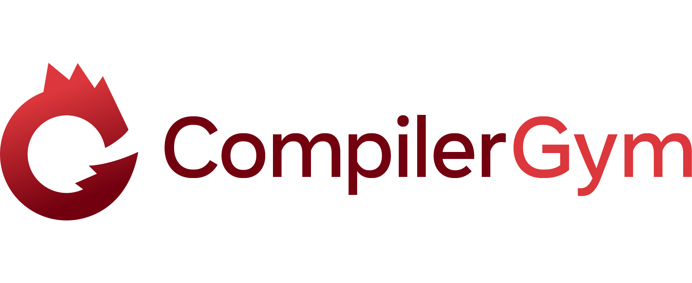

---

<!-- PyPi Version -->
<a href="https://pypi.org/project/compiler-gym/">
    
</a>
<!-- Documentation -->
<a href="http://facebookresearch.github.io/CompilerGym/">
    
</a>
<!-- CI status -->
<a href="https://github.com/facebookresearch/CompilerGym/actions?query=workflow%3ACI+branch%3Adevelopment">
    
</a>
<!-- Downloads counter -->
<a href="https://pypi.org/project/compiler-gym/">
    
</a>
<!-- license -->
<a href="https://tldrlegal.com/license/mit-license">
    
</a>

CompilerGym is a toolkit for exposing compiler optimization problems
for reinforcement learning. It allows machine learning researchers to
experiment with program optimization techniques without requiring any
experience in compilers, and provides a framework for compiler
developers to expose new optimization problems for AI.


# Getting Started

Starting with CompilerGym is simple if you are familiar with other gym environments.

## Installation

Install the latest CompilerGym release using:

    $ pip install compiler_gym

### Building from Source

If you prefer, you may build from source. This requires a modern C++ toolchain.
On macOS you can use the system compiler. On linux, install the required toolchain
using:

    $ sudo apt install clang libtinfo5 patchelf
    $ export CC=clang
    $ export CXX=clang++

We recommend using
[conda](https://docs.conda.io/projects/conda/en/latest/user-guide/install/)
to manage the remaining build dependencies. First create a conda environment
with the required dependencies:

    $ conda create -n compiler_gym python=3.8 bazel=3.1.0 cmake pandoc
    $ conda activate compiler_gym

Then clone the CompilerGym source code using:

    $ git clone https://github.com/facebookresearch/CompilerGym.git
    $ cd CompilerGym

Install the python development dependencies using:

    $ make init

Then run the test suite to confirm that everything is working:

    $ make test

To build and install the python package, run:

    $ make install

When you are finished, you can deactivate and delete the conda
environment using:

    $ conda deactivate
    $ conda env remove -n compiler_gym


## Trying it out

To use the environments, import `compiler_gym`:

```py
>>> import gym
>>> import compiler_gym
>>> env = gym.make("llvm-autophase-ic-v0")
>>> env.require_dataset("npb-v0")       # download a dataset of benchmarks
>>> env.reset()                         # calling reset starts a new compilation episode
>>> env.step(env.action_space.sample()) # apply a random optimization
```

See the
[documentation website](http://facebookresearch.github.io/CompilerGym/) for
tutorials, further details, and API reference.


# Contributing

We welcome contributions to CompilerGym. If you are interested in contributing please see
[this document](CONTRIBUTING.md).


# Citation

If you use CompilerGym in any of your work, please cite:

```
@Misc{CompilerGym,
  author = {Cummins, Chris and Leather, Hugh and Steiner, Benoit and He, Horace and Chintala, Soumith},
  title = {{CompilerGym}: A Reinforcement Learning Toolkit for Compilers},
  howpublished = {\url{https://github.com/facebookresearch/CompilerGym/}},
  year = {2020}
}
```
