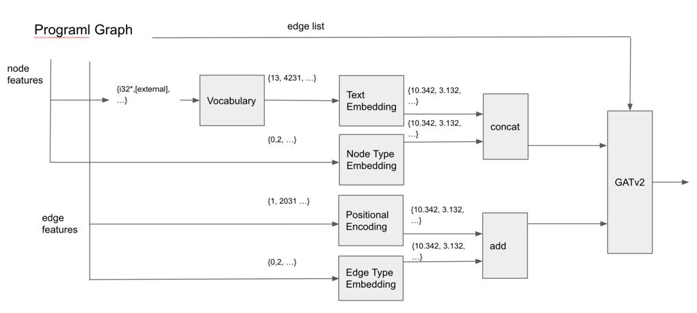

# [Graph Attention Network with DDPPO]

**tldr;**

Naive approach for Programl [2].

Transform heterogeneous graph to homogeneous graph,

by embedding node/edge types to euclidean space.

And the resulting graph encoded with GATv2 [1]

**Authors**

Anthony. W. Jung

**Publication**

Not Available

**Results:**

[Result Table](result.csv)

Codesize Reduction (geomean)  : 1.047

Walltime (mean) : 351.611

**CompilerGym version:**

0.2.3

**Is the approach Open Source?**

Yes, 

https://github.com/kc-ml2/ml-compiler-optimization

**Did you modify the CompilerGym source code?**

I excluded `ghostscript` from the evaluation, couldn't fit it in our resource, we're trying to find a way to handle it. 

**What parameters does the approach have?**

**What range of values were considered for the above parameters?**

Features are encoded with `torch.nn.Embedding`, which is continuous, dense represenation of categorical variables. 

---

for `Node Encoder`

`Text Embedding` size 32,

Rough guess for encoding thousands of text tokens.

`Node Type Embedding` size 32,

It should be large enough to encode 3 node types, since the model must differentiate types properly.

---

for `Edge Encoder`

`Positional Encoding` with max_pos 5120, size 64,

Rough guess for for encoding thousands of positions.

Most datasets(source codes) seemed to have less than ~5000 positions, but this is too naive a number. 

`Edge Type Embedding` size 64,

Similar to Node Type

---

for `GATv2`

https://pytorch-geometric.readthedocs.io/en/latest/modules/nn.html#torch_geometric.nn.conv.GATv2Conv

---

for `DDPPO`

https://docs.ray.io/en/master/rllib/rllib-algorithms.html#decentralized-distributed-proximal-policy-optimization-dd-ppo

You could adjust entropy coefficient for encouraging exploration

**Is the policy deterministic?**

Stochastic.

The policy is sampled from `torch.distribution.Categorical`

## Description

With the encoded features as described above, search state space with RL.

RL model is Actor-Critic, 

and the loss is PPOv2(clipped gradient version) with shared/unshared encoder.

Model is updated in asynchronous manner.

Each benchmark is an episode, episodes are aligned(rolled out) in parallel, as much as our resource allows.

This is to remove temporal correlation(just like what replay memory does)

Action space added with terminal action.

Interestingly in some experiments, agent seemed to learn when to terminate.

Uploaded a training procedure, look at `tune/episode_reward_mean` for learning curve :

https://tensorboard.dev/experiment/9xr6KYmjRHqgYOyrF7gZIA/#scalars

## Referece

[1] https://arxiv.org/abs/2105.14491

[2] https://arxiv.org/abs/2003.10536
